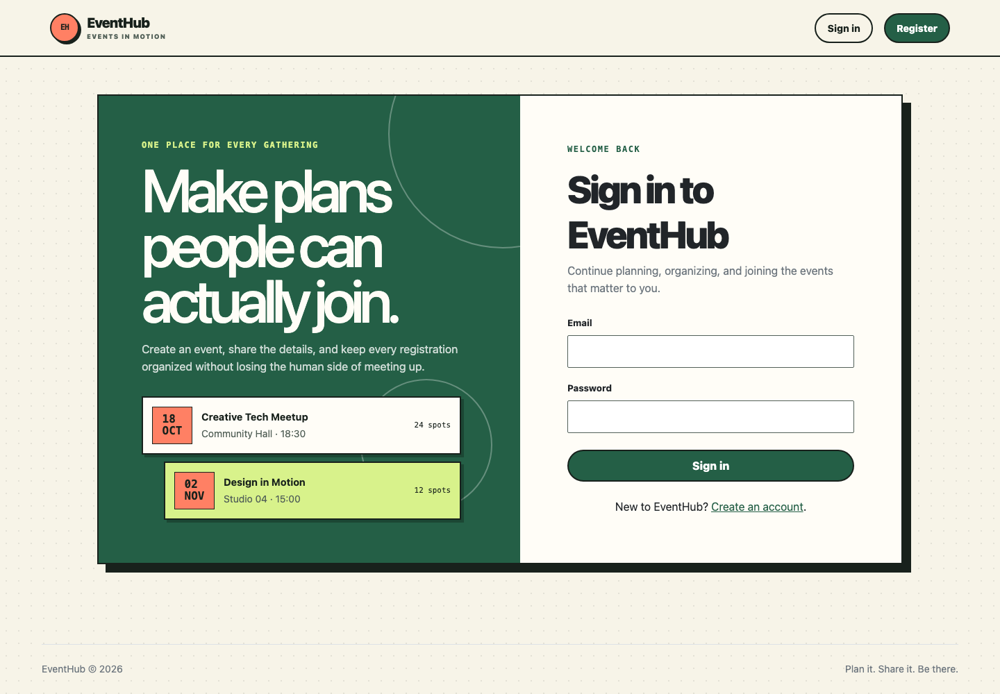

<div align="center">

# EventHub MVC

Create events, welcome attendees, and keep every registration organized.

<p>
  
  
  
  
  
</p>

An event-management application built with a clear MVC architecture for organizers and attendees.

[Open the live application](https://eventhub-mvc-q11u.onrender.com)

</div>

---

## Preview



The interface uses a responsive editorial system built around warm paper tones, deep green, coral accents, and clear event-focused hierarchy.

## About the project

EventHub provides one shared space for planning and joining events. Organizers can create and manage their own events, while attendees can explore upcoming activities, register when seats are available, and review their registrations.

The project focuses on server-rendered pages, role-based permissions, secure sessions, relational data, and a straightforward MVC structure.

## Features

### For attendees

- Account registration, login, and logout
- Browse upcoming events
- View event details and remaining capacity
- Register for available events
- Cancel registrations
- Review personal registration history

### For organizers

- Create, edit, and delete owned events
- Define date, location, description, and capacity
- View the attendee list for each event
- Keep management actions restricted to the event owner

### Security and validation

- Password hashing with `bcryptjs`
- `httpOnly` session cookies
- Role-based route protection
- Server-side input validation
- Parameterized SQL queries
- Duplicate-registration and capacity protection

## Technology

| Area | Technology |
| --- | --- |
| Runtime | Node.js |
| Web framework | Express |
| Views | EJS and Bootstrap 5.3.8 |
| Database | MySQL with `mysql2/promise` |
| Authentication | `express-session` and `bcryptjs` |
| Validation | `express-validator` |
| Deployment | Render |

## MVC architecture

```text
eventhub-mvc/
├── config/         # database connection
├── controllers/    # page and action rules
├── database/       # schema creation script
├── middlewares/    # authentication, permissions, and validation
├── models/         # parameterized SQL queries
├── public/         # styles and public assets
├── routes/         # application endpoints
├── views/          # EJS pages and reusable partials
├── app.js
└── render.yaml
```

## Run locally

### Requirements

- Node.js
- npm
- MySQL

### Installation

```bash
git clone https://github.com/Lime4idan/eventhub-mvc.git
cd eventhub-mvc
npm install
```

1. Run `database/schema.sql` in MySQL.
2. Copy `.env.example` to `.env`.
3. Configure the database and add a long random `SESSION_SECRET`.
4. Start the development server:

```bash
npm run dev
```

The application runs at `http://localhost:3000`. Use `npm start` for a production-style start.

## Environment variables

| Variable | Purpose |
| --- | --- |
| `PORT` | HTTP server port |
| `DB_HOST`, `DB_PORT` | MySQL host and port |
| `DB_USER`, `DB_PASSWORD`, `DB_NAME` | Database credentials and name |
| `DB_SSL` | Enable SSL when required by the provider |
| `DB_SSL_REJECT_UNAUTHORIZED` | Control SSL server verification |
| `DB_SSL_CA_BASE64` | Base64-encoded database CA certificate |
| `SESSION_SECRET` | Long secret used to protect sessions |
| `NODE_ENV` | Runtime environment |

> Never commit real credentials or a production `.env` file to GitHub.

## Deployment

The project is configured for Render and reads its HTTP port from `process.env.PORT`. Configure every value from `.env.example` in the hosting dashboard.

For Aiven MySQL, enable `DB_SSL`, provide the CA certificate through `DB_SSL_CA_BASE64`, and keep server verification enabled. `render.yaml` supports Render Blueprints without storing private database values in the repository.

For a multi-instance production deployment, replace the default in-memory session store with a persistent session store.

## Project status

**Status:** Live and functional  
**Focus:** MVC architecture, authentication, authorization, and relational data

---

<div align="center">

### 🎫 From the first invitation to the final attendee list.

</div>
